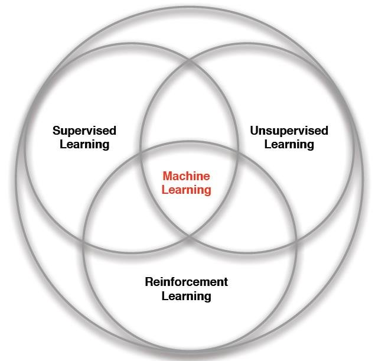
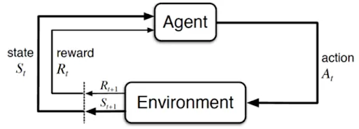
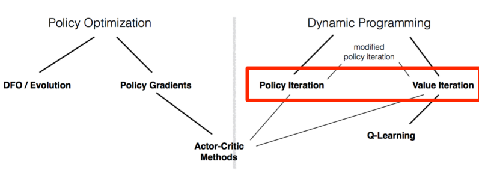

## Introduction to Reinforcement Learning

### Taxonomy of Machine Learning

  

### Markov Decision Processes  
**An MDP is defined by:** 
* Set of states: $S$
* Set of actions: $A$
* Transition function:  $P(s’ | s, a)$
* Reward function: $R(s, a, s’)$
* Start state: $S_{0}$
* Discount factor: $γ$
* Horizon: $H$  

  

  

$$Goal : max_{\pi} [\sum_{t=0}^{H} \gamma^{t}R(S_{t}, A_{t}, S_{t+1})| \pi]$$

#### Example MDP : Grid World

### Exact Solution Methods 

  

  

* The objective in Optimal Control is given an MDP $$ (S,A,P,R,\gamma,H) $$   
Find the Optimal policy $\pi^{*}$

* Exact solution methods to solve MDPs:
    * **Value Iteration**
    * **Policy Iteration**  

**Note:** 
* Exact solutions Methods practically work for Small Discrete state-action spaces as it's easier to use tabular methods for every storing value function of every state
* These only work when the Transition function is known(dynamics of the environment is given!)
#### Value Iteration  
**Optimal Value Function $V^{*}$**  
$$V^{*}(s) = max_{\pi} {\mathbb E}\left[ \sum_{t=0}^{H} \gamma R(s_{t}, a_{t}, s_{t+1}) | \pi , s_{0} = s \right]$$ 
= Sum of discounted rewards when starting from state s and acting optimally  

* $V^{*}_{0} (s) = $ optimal value for state s when H = 0
    * $V^{*}_{0} (s) = 0 \ \forall s$  
* $V^{*}_{1} (s) = $ optimal value for state s when H = 1
    * $V^{*}_{1} (s) = max_{a} \sum_{s'} P(s' | s,a)(R(s,a,s') + \gamma V_{0}^{*}(s'))$  
* $V^{*}_{2} (s) = $ optimal value for state s when H = 2
    * $V^{*}_{2} (s) = max_{a} \sum_{s'} P(s' | s,a)(R(s,a,s') + \gamma V_{1}^{*}(s'))$  
* $V^{*}_{k} (s) = $ optimal value for state s when H = k
    * $V^{*}_{k} (s) = max_{a} \sum_{s'} P(s' | s,a)(R(s,a,s') + \gamma V_{k-1}^{*}(s'))$

##### Algorithm:

* Start with $V_{0}^{s} = 0$ for all s
* For $k = 1, ... , H:$
    * For all states s in S:
        * $V^{*}_{k} (s) \leftarrow max_{a} \sum_{s'} P(s' | s,a)(R(s,a,s') + \gamma V_{k-1}^{*}(s'))$
        * $\pi^{*}_{k} (s) \leftarrow max_{a} \sum_{s'} P(s' | s,a)(R(s,a,s') + \gamma V_{k-1}^{*}(s'))$

This is called a **value update** or **Bellman update/backup**
#### Policy Iteration

## Sampling Based Approximations and Function Fitting

## Deep Q Networks

## Policy Gradient Methods

## Advanced Policy Gradient Methods

## Stochastic Value Gradients

## Model Based RL Methods

## Inverse Reinforcement Learning

