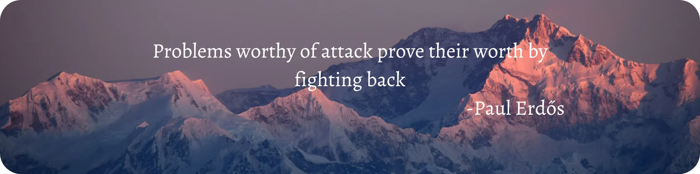

I am a Research Assistant at the [Applied Theory for Machine Learning Research (ATMLR) Lab](https://atmlr-lab.github.io/index.html), IIT Hyderabad, working under the supervision of [Dr.J Saketha Nath](https://people.iith.ac.in/saketha/).   
I completed my BS-MS Dual Degree from [IISER Berhampur](https://www.iiserbpr.ac.in/) with a major in Mathematics and a minor in Computer Science and carried out my Master’s thesis work at [IIT Hyderabad](https://www.iith.ac.in/) under [Dr.Srijith P.K.](https://sites.google.com/site/pksrijith/home) on [Non-Stationary Markov Decision Processes and Continual Reinforcement Learning](https://www.dropbox.com/scl/fi/it6oqxw2gapwsdf81ypyn/MS_Thesis_Final_Submission_Katakam_Sandesh_20062-signed.pdf?rlkey=rz7eetkbfe4qpk29bfifim8e5&st=n9cksfbn&dl=0). During my BS-MS, I was a recipient of the [Indian Academy of Sciences(IASc-INSA-NASI) Summer Research Fellowship (2023)](https://drive.google.com/file/d/1FCjPHI62X9LlxjAldJ7ua4wRB16U7pYD/view?usp=sharing) to work with Dr. Sudarshan Iyengar at IIT Ropar, and also worked as [Summer Undergraduate Reseaerch Fellow(2022)](https://www.dropbox.com/scl/fi/8znyjtgc99tu0rwndhxvw/IITHSummerInternshipCertificate.pdf?rlkey=5rni2mkwqvhuu7u7l4xy5t5fl&st=ta5hn3ki&dl=0) at IIT Hyderabad

**Research,** I am broadly interested in **Reinforcement Learning (RL)** and **Deep Generative Models**. My work focuses on formalizing **control and decision-making problems in RL as inference problems** within generative modeling frameworks. I leverage tools from **optimization and statistics** to develop scalable algorithms for unsupervised reinforcement learning  
**_Keywords:_** _Unsupervised RL, Optimal Transport, Diffusion Models, Stochatic Optimal Control_

**Beyond Core Research,** I have a particular interest in **Machine Learning Systems(MLSys)** with a focus on developing **efficient inference** methods and **distributed training** for large deep learning models. I love Open Source and I spend time actively contributing to open source projects of my own and others (some of them are mentioned on the software page)
  
**Outside Research,**  I enjoy playing Cricket, Travelling and exploring new cuisines, Reading(Non-Fiction!)  
  
I'm actively seeking research opportunities. Feel free to reach out if you’d like to discuss **collaborations, research roles, or cool open-source project ideas**.

Reach out to me on:  or **Drop an Email**
  
Education:
------- 

* __M.S.__ in Mathematics and Computer Science(Minor), IISER Berhampur, 2025
  * Thesis: [Non-Stationary Markov Decision Processes and Continual Reinforcement Learning Algorithms](https://www.dropbox.com/scl/fi/it6oqxw2gapwsdf81ypyn/MS_Thesis_Final_Submission_Katakam_Sandesh_20062-signed.pdf?rlkey=rz7eetkbfe4qpk29bfifim8e5&st=n9cksfbn&dl=0)
  * Advisor: [Dr.Srijith P.K., Department of AI, IIT Hyderabad](https://sites.google.com/site/pksrijith/home)
* __B.S.__ in Mathematics and Computer Science(Minor), Indian Institute of Science Education and Research (IISER) Berhampur, INDIA

  

Research Interests:
------  
>* Reinforcement learning and Sequential Decision-Making
>* Deep Generative Models
>* Statistical Learning Theory
>* Machine Learning Systems (ML for Systems and Systems for ML)

Updates:
------

<table>
<col width="100px" />
<col width="650px" />
<!--  <tr><td><b>March 2024:</b></td><td>Started Building CaaS (Compute as a Service) Startup in Stealth Mode </td></tr> -->
  <tr><td><b>October 2025:</b></td><td>Started as Teaching Assistant for the Graduate and Advanced Undergraduate course: CS5500: Reinforcement Learning at IIT Hyderabad</td></tr>
  <tr><td><b>August 2025:</b></td><td>Started as Teaching Assistant for the Graduate and Advanced Undergraduate course: <a href="https://people.iith.ac.in/saketha/teaching/cs5590.html">CS 5590: Foundations of Machine Learning Course (Jul'25 - Nov'25)</a> at IIT Hyderabad</td></tr>
  <tr><td><b>May 2025:</b></td><td>Started a new position as a Researh Assistant at the <a href="https://atmlr-lab.github.io/index.html">Applied Theory for Machine Learning (ATMLR) Lab</a> under <a href="https://people.iith.ac.in/saketha/">Dr. J Saketha Nath (Associate Professor, IIT Hyderabad)</a> </td></tr>
  <tr><td><b>May 2025:</b></td><td>Submitted and defended Master's Thesis titled: "Non-Stationary Markov Decision Processes and Continual Reinforcement Learning Algorithms": <a href="https://www.dropbox.com/scl/fi/it6oqxw2gapwsdf81ypyn/MS_Thesis_Final_Submission_Katakam_Sandesh_20062-signed.pdf?rlkey=rz7eetkbfe4qpk29bfifim8e5&st=n9cksfbn&dl=0">Thesis PDF</a></td></tr>
  <tr><td><b>December 2024:</b></td><td>Selected as an AI Fellow (one of 10 fellows out of 350+ applicants worldwide) to be a part of the 2-month immersive Pi School of AI program(Rome, Italy) on a 100% scholarship</td></tr>
  <tr><td><b>September 2024:</b></td><td>Started position as Undergraduate Teaching Assistant(TA) at IISER Berhampur for CDS 101: Introduction to Programming with Python (Fall Semester 2024 Sep-Dec) under Dr. Anabik Pal</td></tr>
 <tr><td><b>February 2024:</b></td><td>Selected for Oxford Machine Learning Summer School 2024 for the tracks MLx Representation Learning and MLx Health and Bio to be held at Oxford Mathematical Institute UK</td></tr>
 <tr><td><b>January 2024:</b></td><td>Started as Masters Thesis Student at Bayesian Reasoning and Inference Group at Department of AI, IIT Hyderabad</td></tr>
 <tr><td><b>August 2023:</b></td><td>Worked at REint AI (Startup) as a Deep Learning Intern</td></tr>
 <tr><td><b>July 2023:</b></td><td>Selected for 7th Summer School on Artificial Intelligence 2023 with focus on Computer Vision and Machine Learning by IIIT Hyderabad (In-Person Category)</td></tr>
 <tr><td><b>Mar 2023:</b></td><td>Awarded Summer Research Fellowship by Indian Academy of Sciences to work under Dr. Sudarshan Iyengar HoD of CSE dept at IIT Ropar</td></tr>
  <tr><td><b>Nov 2022:</b></td><td>Started new position in the  Department of Physics, IISER Berhampur as Project student under Dr. Rahul Sharma. I Will be working on denoising models for STM images(scanning tunneling microscopy) </td></tr>
  <tr><td><b>Oct 2022:</b></td><td> Our Team secured Silver Medal  in iGEM Grand Jamboree 2022 at Paris, France</td></tr> 
  <tr><td><b>June 2022:</b></td><td>Started position at iGEM Team IISER Berhampur  in the Modelling Team </td></tr>
  <tr><td><b>May 2022:</b></td><td>Started Internship at IIT Hyderabad, Department of A.I. Under Prof. Srijit P.K. on Neural Differential Equations</td></tr>  
  <tr><td><b>Mar 2022:</b></td><td>Started position as Undergraduate Research Assistant in the NeuroImaging and Brain Research Group, IISER Berhampur under Dr. Vivek Tiwari</td></tr>  
  <tr><td><b>Dec 2020:</b></td><td>Admitted to BS-MS Dual Degree Programme at IISER Berhampur through JEE Advanced Channel</td></tr>

</table>

