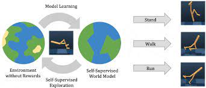
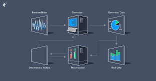

## [Neural Differential Equations]()

Neural Differential Equations are new class of deep learning models that show promising results for tasks like generative modelling, time-series modelling etc. Neural differential equations have applications to both deep learning and traditional mathematical modelling. They offer memory efficiency, the ability to handle irregular data, strong priors on model space, high capacity function approximation, and draw on a deep well of theory on both sides. 
 

## [Model-Based Deep Reinforcement Learning]()

Model-based reinforcement learning (MBRL) focuses on combining the principles of reinforcement learning (RL) with the use of models. RL is a learning paradigm where an agent learns to make sequential decisions in an environment to maximize a reward signal. The key idea in MBRL is to learn a model that approximates the dynamics of the environment. This model can be used by the agent to simulate the future consequences of its actions without actually interacting with the real environment. By leveraging this model, the agent can plan and make decisions more efficiently by exploring different actions and their potential outcomes in a simulated environment.
 

## [Deep Generative Models]()

The research on Deep generative models focuses on developing neural network architectures capable of generating complex and realistic data samples. These models combine deep learning techniques with probabilistic modeling to learn and simulate the underlying distribution of the data.

The key idea behind deep generative models is to capture the underlying patterns and structure of the data by training a deep neural network to generate new samples that resemble the training data. These models can be used for various tasks such as image synthesis, text generation, and data augmentation. Some of the key architectures are Generative Adversarial networks(GANs), Variational AutoEncoders(VAE), Diffusion Models etc.
 

  

