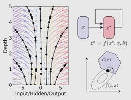

## [Neural Differential Equations]()

Neural Differential Equations are new class of deep learning models that show promising results for tasks like generative modelling, time-series modelling etc. Neural differential equations have applications to both deep learning and traditional mathematical modelling. They offer memory efficiency, the ability to handle irregular data, strong priors on model space, high capacity function approximation, and draw on a deep well of theory on both sides. 
 

## Model-Based Deep Reinforcement Learning

  

